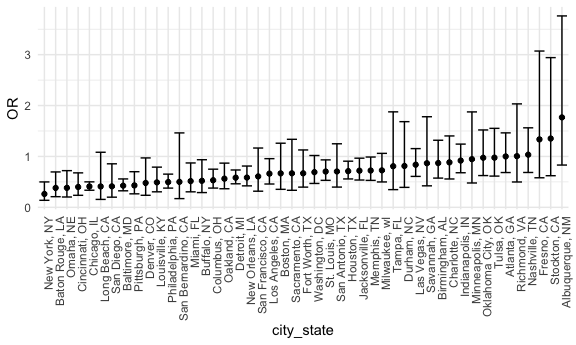
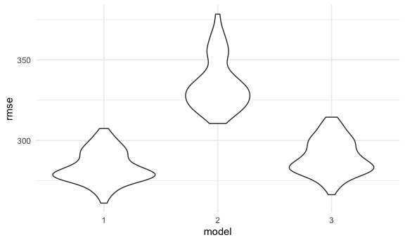

Homework 6
================
Rachel Tao
11/22/20

## Problem 1

import data

``` r
homicide_df <- 
  read_csv("./data/homicide-data.csv", na = c("", "NA", "Unknown")) %>% 
  mutate(
    city_state = str_c(city, state, sep = ", "),
    victim_age = as.numeric(victim_age),
    resolution = case_when(
      disposition == "Closed without arrest" ~ 0,
      disposition == "Open/No arrest" ~ 0,
      disposition == "Closed by arrest" ~ 1)
    ) %>% 
  filter(
    victim_race %in% c("White", "Black"),
    city_state != "Tulsa, AL") %>% 
  select(city_state, resolution, victim_age, victim_race, victim_sex)
```

    ## 
    ## ── Column specification ────────────────────────────────────────────────────────
    ## cols(
    ##   uid = col_character(),
    ##   reported_date = col_double(),
    ##   victim_last = col_character(),
    ##   victim_first = col_character(),
    ##   victim_race = col_character(),
    ##   victim_age = col_double(),
    ##   victim_sex = col_character(),
    ##   city = col_character(),
    ##   state = col_character(),
    ##   lat = col_double(),
    ##   lon = col_double(),
    ##   disposition = col_character()
    ## )

Start with one city.

``` r
baltimore_df =
  homicide_df %>% 
  filter(city_state == "Baltimore, MD")

glm(resolution ~ victim_age + victim_race + victim_sex,
    data = baltimore_df,
    family = binomial()) %>% 
  broom::tidy() %>% 
  mutate(
    OR = exp(estimate),
    CI_lower = exp(estimate - 1.96*std.error),
    CI_upper = exp(estimate + 1.96*std.error)
  ) %>% 
  select(term, OR, starts_with("CI")) %>% 
  knitr::kable(digits = 3)
```

| term              |    OR | CI\_lower | CI\_upper |
| :---------------- | ----: | --------: | --------: |
| (Intercept)       | 1.363 |     0.975 |     1.907 |
| victim\_age       | 0.993 |     0.987 |     1.000 |
| victim\_raceWhite | 2.320 |     1.648 |     3.268 |
| victim\_sexMale   | 0.426 |     0.325 |     0.558 |

Try this across cities

``` r
model_results_df <-   
  homicide_df %>% 
  nest(data = -city_state) %>% 
  mutate(
    models = 
      map(.x = data, ~glm(resolution ~ victim_age + victim_race + victim_sex, data = .x, family = binomial())),
    results = map(models, broom::tidy)
  ) %>% 
  select(city_state, results) %>% 
  unnest(results) %>% 
  mutate(
    OR = exp(estimate),
    CI_lower = exp(estimate - 1.96*std.error),
    CI_upper = exp(estimate + 1.96*std.error)
  ) %>% 
  select(city_state, term, OR, starts_with("CI"))
```

``` r
model_results_df %>% 
  filter(term == "victim_sexMale") %>% 
  mutate(city_state = fct_reorder(city_state, OR)) %>% 
  ggplot(aes(x = city_state, y = OR)) +
  geom_point() +
  geom_errorbar(aes(ymin = CI_lower, ymax = CI_upper)) +
  theme(axis.text.x = element_text(angle = 90, hjust = 1))
```



## Problem 2

import data

``` r
child_birthweight <- read_csv("./data/birthweight.csv") %>% 
  mutate(
    babysex = as.factor(babysex),
    fincome = as.factor(fincome),
    frace = as.factor(frace),
    malform = as.factor(malform),
    mrace = as.factor(mrace),
  )
```

    ## 
    ## ── Column specification ────────────────────────────────────────────────────────
    ## cols(
    ##   .default = col_double()
    ## )
    ## ℹ Use `spec()` for the full column specifications.

This dataset includes factors potentially affecting child birthweight
for 4342 children. Variables include birthweight (grams), child’s sex
(coded as 1 for male, 2 for female), head circumference at birth, length
at birth (cm), mother’s weight at time of delivery (lbs), family monthly
income (in hundreds, rounded), each parent’s race (1 = white, 2 = Black,
3 = Asian, 4 = Puerto Rican, 8 = other, 9 = unknown), gestational age in
weeks, presence or absence of malformations that could impact
birthweight (0 if absent, 1 if present), mother’s age at menarche
(years), mother’s height (in), mother’s age at delivery (years), number
of live births prior to this pregnancy, previous numer of low birth
weight babies, number of small for gestational age babies, mother’s
pre-pregnancy BMI, average number of cigarettes per day smoked by mother
during pregnancy, and mother’s weigth gain during pregnancy (lbs). I
converted coded categorical variables from numeric to factor, including
child’s sex, family income, each parent’s race, and presence or absence
of malformations that could affect weight. It looks like there are 0
missing values.

To build model 1, I used theory to inform which variables to include and
tested several biologically plausible interaction terms before. I only
included statistically significant interactions in the final model.

I chose to include birth length and birth height because they are common
anthropometric measures that are likely to correlate with birth weight
for healthy babies as well as for low birthweight babies. I chose
gestational age at birth and average number of cigarettes smoked per day
during pregnancy by mom as potential predictors of low birthweight, with
the hypothesis that increased cigarette smoking and smaller gestational
age at birth are associated with low birthweight. I chose to include
mother’s weight at the time of delivery as a potential predictor of low
birthweight, with the hypothesis that higher maternal weight at delivery
would be associated with high birthweight. I then tested interactions
between variables that could contribute to abnormal birthweights:
average number of cigarettes per day during pregnancy, gestational age
at birth, and maternal weight at delivery. The only interaction that was
significant was between maternal weight at time of delivery and
gestational age at birth, so I included this interaction, along with
anthropomorphic measures, in the final model.

``` r
model_1 = lm(bwt ~ blength + bhead + smoken + delwt*gaweeks, data = child_birthweight)
```

Diagnostics: plot residuals against predicted values

``` r
model_fit <- 
  child_birthweight %>% 
  add_residuals(model_1) %>% 
  add_predictions(model_1)

model_fit %>% 
  ggplot(aes(x = resid)) +
  geom_density()
```


``` r
model_fit %>%  
  ggplot(aes(x = pred, y = resid)) +
  geom_point()
```


models to compare:

``` r
model_2 = lm(bwt ~ blength + gaweeks, data = child_birthweight)
model_3 = lm(bwt ~ bhead + blength + babysex + bhead * blength * babysex, data = child_birthweight)
```

cross validation:

``` r
cv_df =
  crossv_mc(child_birthweight, 100)

cv_df =
  cv_df %>% 
  mutate(
    train = map(train, as_tibble),
    test = map(test, as_tibble)
  )

cv_df =
  cv_df %>% 
  mutate(
    model_1 = map(.x = train, ~lm(bwt ~ blength + bhead + smoken + delwt*gaweeks, data = .x)),
    model_2 = map(.x = train, ~lm(bwt ~ blength + gaweeks, data = .x)),
    model_3 = map(.x = train, ~lm(bwt ~ bhead + blength + babysex + bhead * blength * babysex, data = .x))
  ) %>% 
  mutate(
    rmse_1 = map2_dbl(model_1, .y = test, ~rmse(model = .x, data = .y)),
    rmse_2 = map2_dbl(model_2, .y = test, ~rmse(model = .x, data = .y)),
    rmse_3 = map2_dbl(model_3, .y = test, ~rmse(model = .x, data = .y))
  )
```

Visualize RMSE’s

``` r
cv_df %>% 
  select(starts_with("rmse")) %>% 
  pivot_longer(
    everything(),
    names_to = "model",
    values_to = "rmse",
    names_prefix = "rmse_"
  ) %>% 
  ggplot(aes(x = model, y = rmse)) +
  geom_violin()
```



Model 1 and model 2 are comparable, but the RMSE for model 2 is larger.
Since the model 1 RMSE appears marginally smaller than model 3, I would
choose model 1 for prediction.

## Problem 3

import data

``` r
weather_df = 
  rnoaa::meteo_pull_monitors(
    c("USW00094728"),
    var = c("PRCP", "TMIN", "TMAX"), 
    date_min = "2017-01-01",
    date_max = "2017-12-31") %>%
  mutate(
    name = recode(id, USW00094728 = "CentralPark_NY"),
    tmin = tmin / 10,
    tmax = tmax / 10) %>%
  select(name, id, everything())
```

    ## Registered S3 method overwritten by 'hoardr':
    ##   method           from
    ##   print.cache_info httr

    ## using cached file: /Users/rht2112/Library/Caches/R/noaa_ghcnd/USW00094728.dly

    ## date created (size, mb): 2020-10-05 16:46:52 (7.522)

    ## file min/max dates: 1869-01-01 / 2020-10-31

linear regression model

``` r
lm(tmax ~ tmin, data = weather_df)
```

    ## 
    ## Call:
    ## lm(formula = tmax ~ tmin, data = weather_df)
    ## 
    ## Coefficients:
    ## (Intercept)         tmin  
    ##       7.209        1.039
